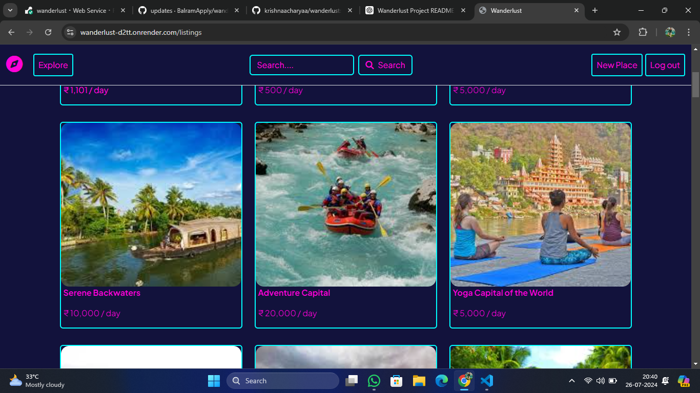

<div>
  <h2> Overview</h2>
</div>



---

<div>
  <h2> Overview</h2>
</div>

Wanderlust is a full-stack MARN stack application designed to provide a platform similar to Airbnb, where users can search for accommodations, make bookings, and leave reviews. With a sleek and intuitive interface, Wanderlust aims to make finding and booking your next adventure easy and enjoyable.

---

<div>
  <h2> Overview</h2>
</div>

---
- [Features](#features)
- [Technologies](#technologies)
- [Installation](#installation)
- [Usage](#usage)
- [Screenshots](#screenshots)
- [Contributing](#contributing)
- [License](#license)
- [Contact](#contact)

---

## Features


- User authentication and authorization
- Search accommodations by country, city, or specific criteria
- View detailed listings with photos, descriptions, and reviews
- Make bookings and manage reservations
- Post and view reviews of accommodations
- Responsive design for seamless experience on all devices

---

## Technologies


- **MongoDB**: Database
- **Express.js**: Backend framework
- **React.js**: Frontend library
- **Node.js**: Server environment

---

## Installation


1. **Clone the repository**
    ```bash
    git clone https://github.com/yourusername/wanderlust.git
    cd wanderlust
    ```

2. **Install dependencies**
    ```bash
    npm install
    cd client
    npm install
    cd ..
    ```

3. **Set up environment variables**
    Create a `.env` file in the root directory and add the following:
    ```env
    MONGO_URI=your_mongodb_uri
    JWT_SECRET=your_jwt_secret
    ```

4. **Run the application**
    ```bash
    npm run dev
    ```

---

## Usage


1. **Register and log in** to access all features.
2. **Search for accommodations** by entering a location or using filters.
3. **View accommodation details** including photos, descriptions, and reviews.
4. **Make a booking** by selecting available dates.
5. **Leave a review** after your stay.

---

## Screenshots


*Homepage*


*Search Results*


*Listing Details*

---

## Contributing


Contributions are welcome! Please fork the repository and create a pull request with your changes. Ensure your code follows the project's coding standards and include relevant tests.

1. Fork the repository
2. Create your feature branch
    ```bash
    git checkout -b feature/YourFeature
    ```
3. Commit your changes
    ```bash
    git commit -m 'Add YourFeature'
    ```
4. Push to the branch
    ```bash
    git push origin feature/YourFeature
    ```
5. Open a pull request

---

## License


This project is licensed under the MIT License. See the [LICENSE](LICENSE) file for details.

---

## Contact


For any questions or suggestions, please reach out to:

- **Name**: Your Name
- **Email**: your.email@example.com
- **GitHub**: [yourusername](https://github.com/yourusername)

---

*Happy wandering with Wanderlust!*
